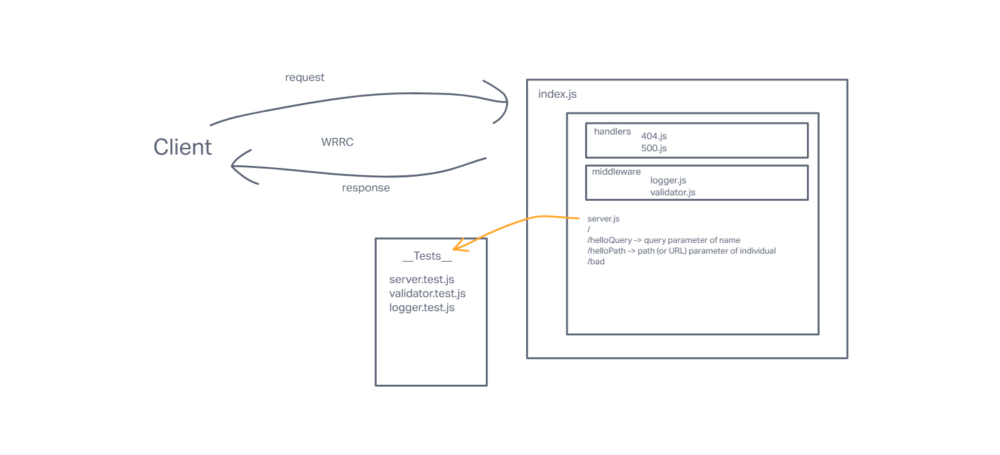

# LAB - Class 02

## Project: basic-express-server

### Author: Seth Pierce

### Problem Domain

 From a business requirements standpoint, we will be building a basic Express server using best practices, including server modularization, use of middleware, and tests.

### Links and Resources

- [ci/cd](https://github.com/sethppierce/basic-express-server/actions) (GitHub Actions)
- [prod deployment](https://basic-express-server-ha46.onrender.com) (when applicable)
- [dev deployment](https://basic-express-server-dev.onrender.com) (when applicable)

### Setup

#### `.env` requirements (where applicable)

- PORT: 3001

#### How to initialize/run your application (where applicable)

- nodemon

#### Features / Routes

- Feature One: Deploy to Dev
- GET: `/` - route to hit
- Feature Two: Deploy to Prod
- GET: `/bad` - route to hit
- GET: `/person` - route to hit, with name query

#### Tests

- How do you run tests?
  - npm test
- Any tests of note?
  - handles root path
  - handles invalid requests
  - handles errors
  - logs as expected

#### UML

